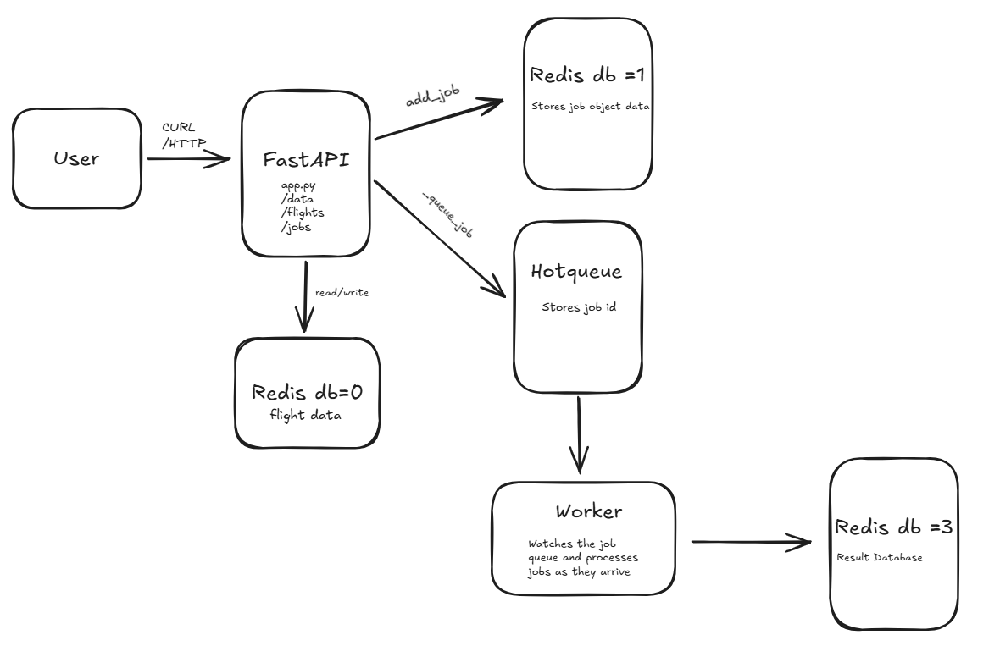

# On-Time Flights Analysis Backend

## Overview

This project builds a containerized FastAPI application that interfaces with a **flight dataset**. The application reads flight records from a CSV file, stores them in a **Redis database**, and exposes **REST endpoints** for querying and managing the data.

The system also supports an ** job queue** powered by Redis and HotQueue. Users can submit jobs to query flight data, which are processed in the background by a dedicated worker container.

The entire system is containerized using Docker and orchestrated with Docker Compose — deploy everything with a single command.

Sourced from the [Bureau of Transportation Statistics](https://transtats.bts.gov/Fields.asp?gnoyr_VQ=FGK)

---

## Project Files

- `app.py`: Main FastAPI application. Defines all routes, CSV parsing logic, Redis interactions, and Pydantic models.
- `jobs.py`: Shared job logic. Defines job models, status enums, Redis/queue clients, and helper functions used by both the API and worker.
- `worker.py`: Background worker. Watches the job queue and processes jobs as they arrive.
- `Dockerfile`: Defines the container environment shared by the API and worker.
- `docker-compose.yml`: Orchestrates the API, worker, and Redis containers together.
- `data/small_sample_data.csv`: Local flight dataset used for loading data.
- `/test/test_api.py`: Test the FastAPI Routes
- `/test/test_jobs.py`: Tests the functions in jobs
- `/test/test_worker.py`: Tests the worker
- `README.md`: Project documentation. THIS FILE

---

## Data

The dataset is a flight records CSV file stored locally at `data/small_sample_data.csv`.

Each row represents a flight and includes fields such as:

- `FL_DATE`: Flight date
- `MKT_UNIQUE_CARRIER`: Airline carrier
- `ORIGIN` / `DEST`: Origin and destination airports
- `ORIGIN_CITY_NAME` / `DEST_CITY_NAME`: City-level info
- `CRS_DEP_TIME` / `CRS_ARR_TIME`: Scheduled departure and arrival times
- `DEP_DELAY` / `ARR_DELAY`: Delay values in minutes
- `CANCELLED` / `DIVERTED`: Flight status flags
- Delay breakdowns: `CARRIER_DELAY`, `WEATHER_DELAY`, `NAS_DELAY`, `SECURITY_DELAY`, `LATE_AIRCRAFT_DELAY`

The dataset may contain missing values — the application handles sparse data gracefully using optional fields.

---

## Running the Application

From the project directory:

```bash
docker compose up -d --build
```

This will:

- Build the FastAPI and worker containers
- Start the Redis container
- Start the API server on port `8000`
- Start the background worker listening for jobs

After you are done running the code you can close everything by doing:

```bash
docker compose down
```

---

## Example API Queries

### 1. Load Data into Redis

Trigger ingestion from the flight dataset

```bash
curl -X POST localhost:8000/data
```

**Expected Output:**

```
{"message":"Flight data loaded into Redis","data_loaded":28}
```

---

### 2. Returrn all Data from Redis

Returns all of the flight data in Redis in json.

```bash
curl -X GET http://localhost:8000/data
```

**Expected Output:**

```
... {"DAY_OF_WEEK":1,"FL_DATE":"1/6/2025 12:00:00 AM","MKT_UNIQUE_CARRIER":"AA","ORIGIN_AIRPORT_ID":10423,"ORIGIN_AIRPORT_SEQ_ID":1042302,"ORIGIN_CITY_MARKET_ID":30423,"ORIGIN":"AUS","ORIGIN_CITY_NAME":"Austin, TX","DEST_AIRPORT_ID":11298,"DEST_AIRPORT_SEQ_ID":1129806,"DEST_CITY_MARKET_ID":30194,"DEST":"DFW","DEST_CITY_NAME":"Dallas/Fort Worth, TX","CRS_DEP_TIME":"0802","DEP_DELAY":null,"CRS_ARR_TIME":"0914","ARR_DELAY":null,"CANCELLED":1.0,"DIVERTED":0.0,"CARRIER_DELAY":null,"WEATHER_DELAY":null,"NAS_DELAY":null,"SECURITY_DELAY":null,"LATE_AIRCRAFT_DELAY":null}]
```

---

### 3. Get All Flight IDs

Outputs all of the flight ids in redis as a list.

```bash
curl -X GET http://localhost:8000/flights
```

**Expected Output:**

```json
[
  "5",
  "18",
  "1",
  "13",
  "6",
  "4",
  "10",
  "23",
  "20",
  "9",
  "24",
  "17",
  "12",
  "8",
  "3",
  "25",
  "14",
  "19",
  "26",
  "21",
  "16",
  "27",
  "2",
  "15",
  "0",
  "22",
  "7",
  "11"
]
```

---

### 4. Get Specific Flight Data

Gives the information about a specific flight, inputing the flight id.

```bash
curl -X GET http://localhost:8000/flights/0
```

**Expected Output:**

```json
{
  "DAY_OF_WEEK": 1,
  "FL_DATE": "1/6/2025 12:00:00 AM",
  "MKT_UNIQUE_CARRIER": "AA",
  "ORIGIN_AIRPORT_ID": 10135,
  "ORIGIN_AIRPORT_SEQ_ID": 1013506,
  "ORIGIN_CITY_MARKET_ID": 30135,
  "ORIGIN": "ABE",
  "ORIGIN_CITY_NAME": "Allentown/Bethlehem/Easton, PA",
  "DEST_AIRPORT_ID": 11057,
  "DEST_AIRPORT_SEQ_ID": 1105703,
  "DEST_CITY_MARKET_ID": 31057,
  "DEST": "CLT",
  "DEST_CITY_NAME": "Charlotte, NC",
  "CRS_DEP_TIME": "0606",
  "DEP_DELAY": -12.0,
  "CRS_ARR_TIME": "0812",
  "ARR_DELAY": -12.0,
  "CANCELLED": 0.0,
  "DIVERTED": 0.0,
  "CARRIER_DELAY": null,
  "WEATHER_DELAY": null,
  "NAS_DELAY": null,
  "SECURITY_DELAY": null,
  "LATE_AIRCRAFT_DELAY": null
}
```

---

### 5. Delete Data

Deletes all of the flight data in redis.

```bash
curl -X DELETE http://localhost:8000/data
```

**Expected Output:**

```
{"message":"All flight data deleted from Redis"}
```

---

### 6. Creating A New Job

This route creates a JobRequest object with our inputs being the origin, dest, and date of our flight, outputs the resultant JobRequest object created.

Note that the job id that shows up will be different from the one displayed in the README

```bash
curl -X POST localhost:8000/jobs  -H "Content-Type: application/json" -d '{"origin": "ABE", "dest": "CLT", "date": "1/6/2025 12:00:00 AM"}'
```

**Expected Output:**

```
{"id":"34cdf3b5-30cf-4f08-8760-b25914cf06aa","status":"QUEUED","origin":"ABE","dest":"CLT","date":"1/6/2025 12:00:00 AM","start_time":null,"end_time":null}
```

---

### 7. Getting all of the Jobs

Returns all of the job_ids in a list.

Note that the job id that shows up will be different from the one displayed in the README

```bash
curl -X GET localhost:8000/jobs
```

**Expected Output:**

```
["34cdf3b5-30cf-4f08-8760-b25914cf06aa"]
```

---

### 8. Return Job Information Given ID

Returns the information about the job when you input it's job id, if you run this 30 seconds or less after the job was created, then the status will show as RUNNING instead of FINISHED.

Based on the job id that was out put from app.get(/jobs), put that id into the curl

```bash
curl -X GET localhost:8000/jobs/{job_id}
```

**Expected Output:**

```
{"id":"34cdf3b5-30cf-4f08-8760-b25914cf06aa","status":"FINISHED -- SUCCESS","origin":"ABE","dest":"CLT","date":"1/6/2025 12:00:00 AM","start_time":"2026-04-09T00:10:31.467593","end_time":"2026-04-09T00:11:01.472653"}
```

---

### 9. Return Job Results Given ID

Returns the resuls that the worker retrieved. In our context, it will retrieve all of the flights with a specific origin, destination, and day with average delays and number of canellations/diversions.

First here's an example job to add, we want all of the flights that left on january 6th from Austin to Dallas-Fort Worth, first post the job with this command:

```bash
curl -X POST http://localhost:8000/jobs   -H "Content-Type: application/json"   -d '{
    "origin": "AUS",
    "dest": "DFW",
    "date": "1/6/2025"
  }'
```

Use that job ID you get from the output of the query to put into this next api query:

```bash
curl -X GET localhost:8000/results/{job_id}
```

**Expected Output:**

```
... {"origin":"AUS","dest":"DFW","date":"1/6/2025"},"summary":{"total_flights":14,"avg_departure_delay":30.923076923076923,"avg_arrival_delay":31.153846153846153,"cancelled_flights":1,"diverted_flights":0} ...
```

As you can see, our dataset has 14 flights from Austin to Dallas-Fort Worth on January 6th, 2025, and there tends to be on average a 30 minute delay for these flights.

---

## Logging

To see the logging in our code, while still running the docker containers, type in the command:

```bash
docker logs final-project-api-test

```

**Expected Output:**

```
...
2026-04-15 23:55:44,369 [INFO] watchfiles.main: 4 changes detected
2026-04-15 23:55:57,510 [INFO] app: Creating job: {'origin': 'AUS', 'dest': 'DFW', 'date': '1/6/2025'}
2026-04-15 23:55:57,511 [INFO] jobs: Adding job origin=AUS, dest=DFW, date=1/6/2025
2026-04-15 23:55:57,519 [INFO] jobs: Job queued successfully
2026-04-15 23:55:57,519 [INFO] app: Job created: 500f8cca-4c29-40e0-8d5c-0efc404f8835
      INFO   172.19.0.1:54260 - "POST /jobs HTTP/1.1" 200
      INFO   172.19.0.1:52674 - "GET
             /results/500f8cca-4c29-40e0-8d5c-0efc404f8835 HTTP/1.1" 200
```

and also

```bash
docker logs final-project-worker-test

```

**Expected Output:**

```
...
2026-04-15 23:55:57,521 [INFO] jobs: Starting job 500f8cca-4c29-40e0-8d5c-0efc404f8835
2026-04-15 23:55:57,525 [INFO] jobs: Job 500f8cca-4c29-40e0-8d5c-0efc404f8835 status -> JobStatus.RUNNING
2026-04-15 23:55:57,536 [INFO] __main__: Job 500f8cca-4c29-40e0-8d5c-0efc404f8835 analysis complete
2026-04-15 23:55:57,538 [INFO] __main__: Job 500f8cca-4c29-40e0-8d5c-0efc404f8835 finished successfully
2026-04-15 23:55:57,538 [INFO] jobs: Job 500f8cca-4c29-40e0-8d5c-0efc404f8835 status -> JobStatus.SUCCESS
```

---

## Integration Test For Functions That Are API Routes

To test our code, while the container is still running, type in:

```bash
REDIS_HOST=localhost PYTHONPATH=. uv run pytest
```

---

## Diagram



Please let me know if you have any questions! Thanks!
